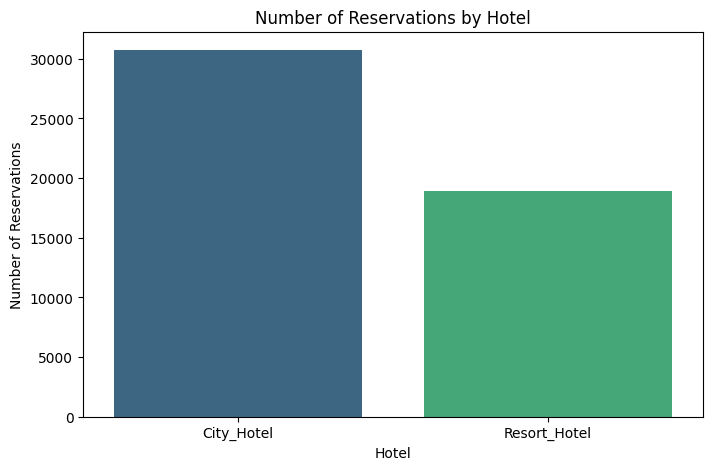
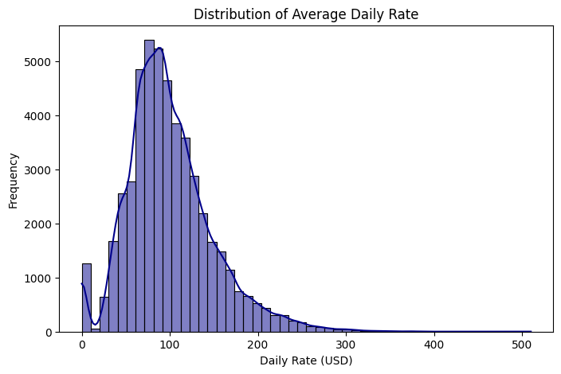
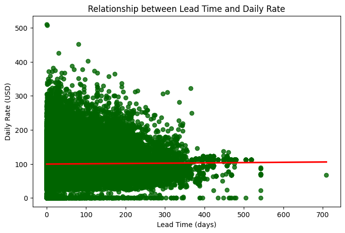
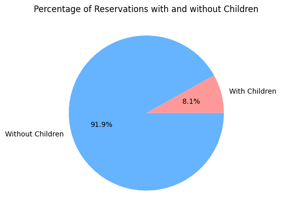
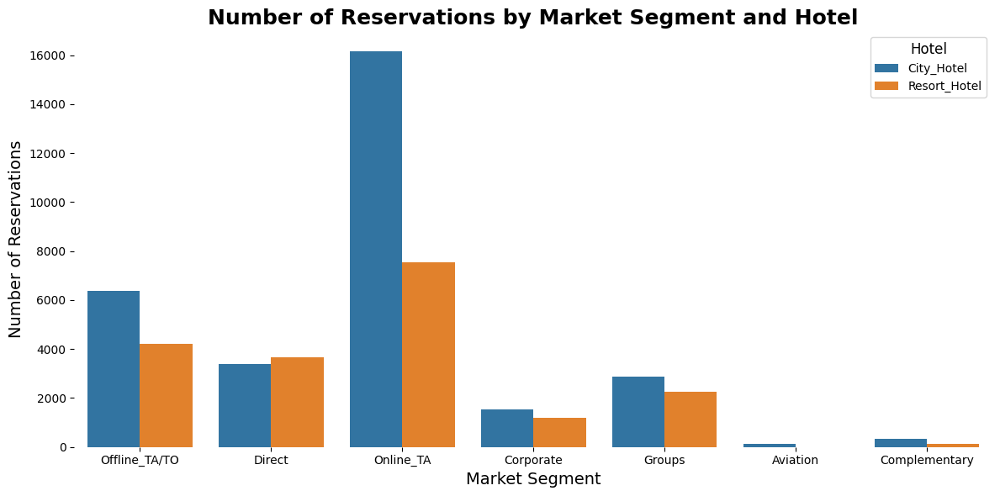
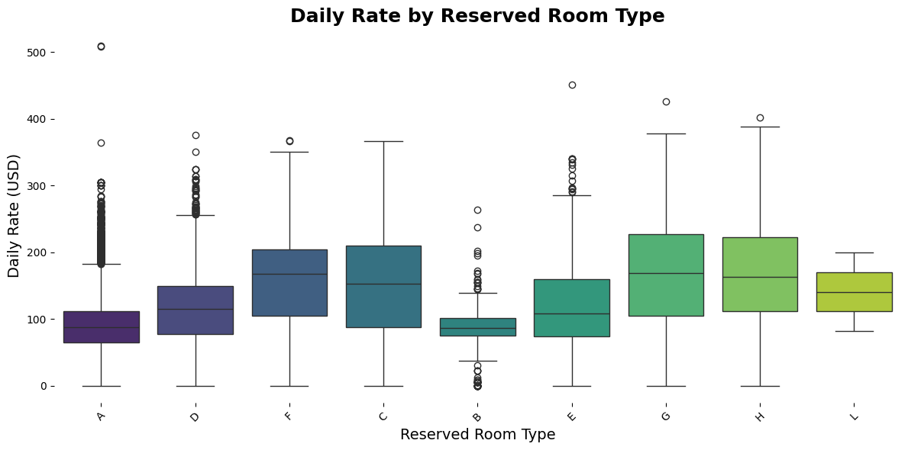
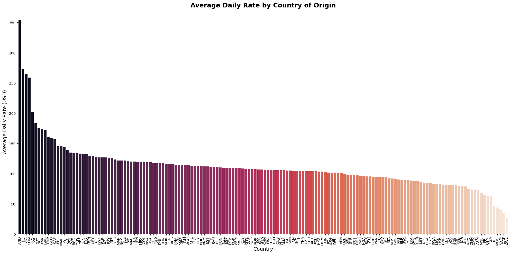
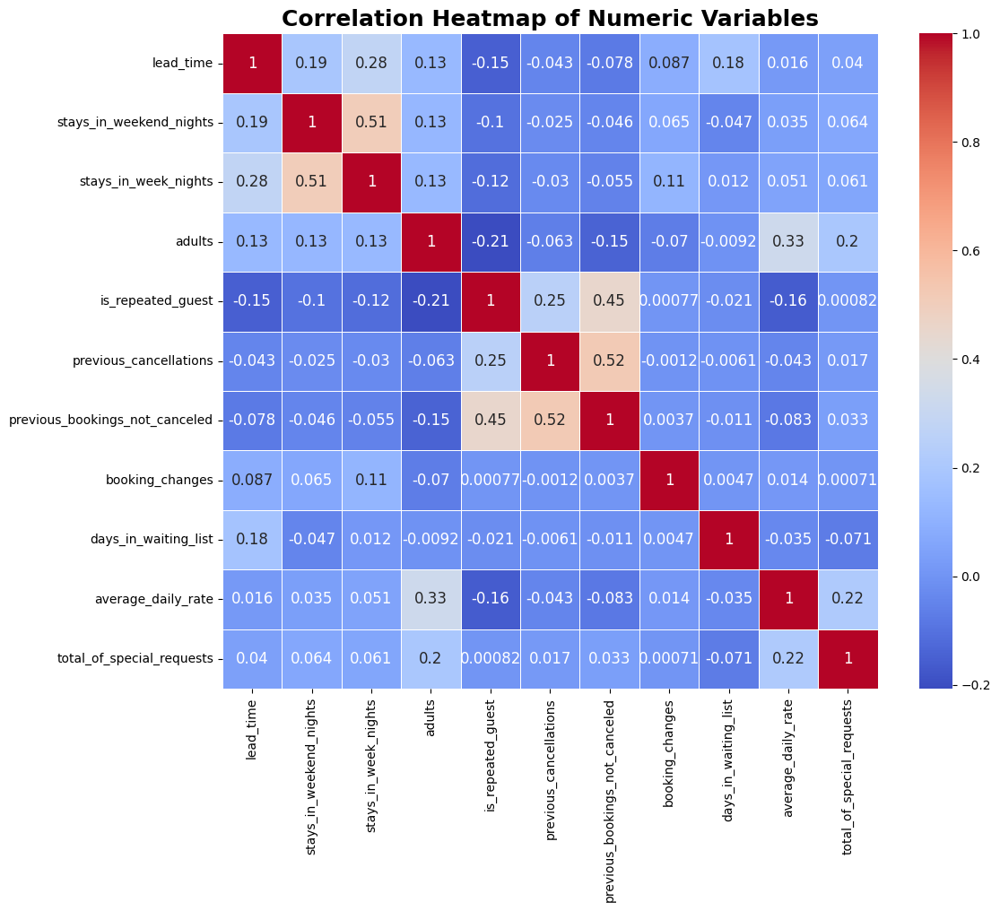
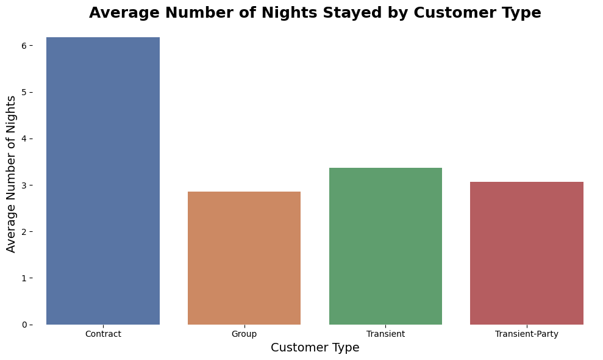
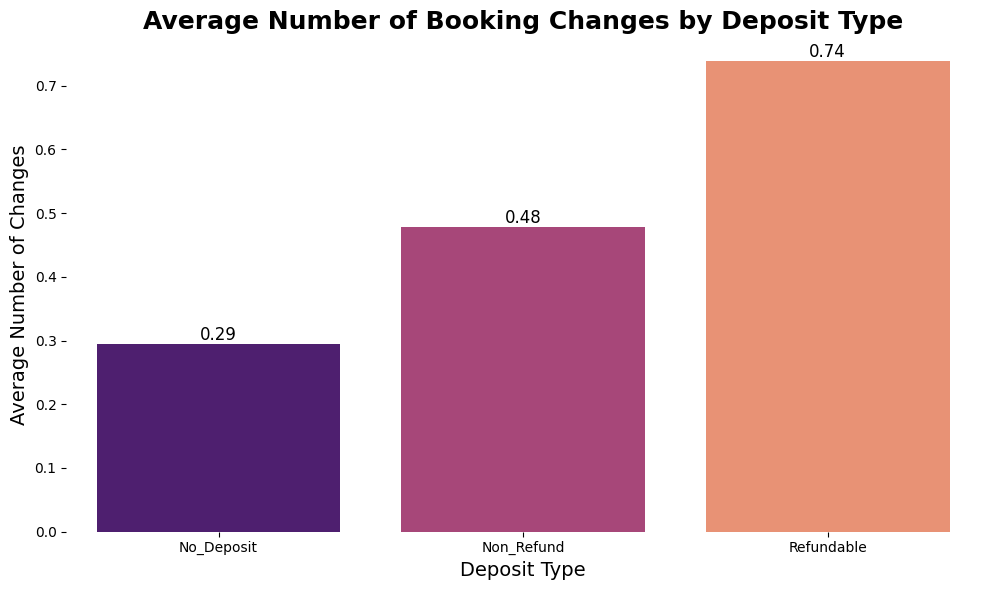

# Hotel Bookings Data Analysis and Prediction

## Part I - Exploratory Data Analysis

### Data Quality Check

The dataset contains 50,000 entries with 23 columns. Initial inspection revealed:
- Missing values in the 'country' column (289 entries).
- Negative values in the 'average_daily_rate' column.

**Corrective Actions:**
- Removed rows with missing 'country' values.
- Removed rows with negative 'average_daily_rate' values.

### Key Findings and Insights

#### 1. Number of Reservations by Hotel

- **Conclusion:** The city hotel has a significantly higher number of reservations compared to the resort hotel. This may be due to location, accessibility, and customer demand for urban stays.

#### 2. Distribution of Average Daily Rate

- **Conclusion:** Most daily rates are concentrated between 50 and 150 USD, with a right-skewed distribution. This suggests that most customers opt for moderate rates, with fewer customers willing to pay very high rates.

#### 3. Relationship between Lead Time and Daily Rate

- **Conclusion:** There is no clear relationship between lead time and daily rate. However, there is a trend towards lower rates for bookings made further in advance. This can be used for dynamic pricing strategies.

#### 4. Percentage of Reservations with and without Children

- **Conclusion:** The majority of reservations (91.9%) are without children, while only 8.1% include children. This may indicate that hotels are more frequently booked by solo adults or couples, and less by families.

#### 5. Number of Reservations by Market Segment and Hotel

- **Conclusion:** The largest market segment is online travel agencies (Online_TA), especially for city hotels. Corporate and group segments are smaller in comparison. This suggests that marketing and sales strategies should focus on strengthening relationships with online travel agencies.

#### 6. Daily Rate by Reserved Room Type

- **Conclusion:** Daily rates vary considerably by reserved room type. Room types 'G' and 'H' have the highest rates, while types 'A' and 'B' are more economical. This may reflect differences in room size, amenities, and location.

#### 7. Average Daily Rate by Country of Origin

- **Conclusion:** There is significant variability in average daily rates by country of origin. Countries with higher rates may be associated with higher purchasing power or specific tourist seasons.

#### 8. Correlation Heatmap of Numeric Variables

- **Conclusion:** The strongest correlations are observed between previous cancellations and previous bookings not canceled (0.52), and between weekday and weekend nights (0.51). This suggests that customers with a history of cancellations tend to have consistent behavior, and that stays often include both weekday and weekend nights.

#### 9. Average Number of Nights Stayed by Customer Type

- **Conclusion:** Contract customers have the longest stays, averaging over 6 nights. Transient and group customers have shorter stays, around 3 to 4 nights. This indicates that contracts may be associated with longer stays, possibly due to corporate or long-term agreements.

#### 10. Average Number of Booking Changes by Deposit Type

- **Conclusion:** Bookings with refundable deposits have a significantly higher average number of changes (0.74) compared to no deposit (0.29) and non-refundable deposits (0.48). This suggests that customers who opt for refundable deposits tend to modify their bookings more, possibly due to the flexibility these deposits offer.

### Business Perspective

- **Flexibility and Changes:** Refundable deposits attract customers who value flexibility, which can be a strategy to increase customer satisfaction.
- **Customer Segmentation:** Contract customers and transient customers have different stay patterns, suggesting the need for differentiated marketing strategies.
- **Pricing Strategies:** Variability in daily rates by country and room type indicates opportunities for dynamic and personalized pricing strategies.
- **Focus on Online Travel Agencies:** Given the high volume of bookings through online travel agencies, it is crucial to maintain and strengthen these relationships.
- **Families vs. Adults:** The low proportion of bookings with children suggests that hotels could explore specific offers and promotions to attract more families.

## Part II - Modeling

### Feature Extraction

- **Total Nights:** Sum of `stays_in_week_nights` and `stays_in_weekend_nights`.
- **Is Family:** Binary feature indicating if the booking includes children.
- **Lead Time Category:** Categorized lead time into short, medium, and long.

### Model Training and Evaluation

Three models were trained to predict which reservations include children:
- **Logistic Regression**
- **Decision Tree**
- **Random Forest**

#### Model Performance

**Logistic Regression**
- **Accuracy:** 93.78%
- **Precision (Class 0):** 0.94
- **Recall (Class 0):** 0.99
- **Precision (Class 1):** 0.78
- **Recall (Class 1):** 0.35

**Decision Tree**
- **Accuracy:** 91.49%
- **Precision (Class 0):** 0.95
- **Recall (Class 0):** 0.95
- **Precision (Class 1):** 0.49
- **Recall (Class 1):** 0.50

**Random Forest**
- **Accuracy:** 94.32%
- **Precision (Class 0):** 0.95
- **Recall (Class 0):** 0.99
- **Precision (Class 1):** 0.78
- **Recall (Class 1):** 0.45

### Summary

- **Transformations:** The pipeline included transformations for feature extraction and data cleaning.
- **Models:** Three different models were trained.
- **Conclusions:** The **Random Forest Classifier** is the most effective model for predicting reservations that include children, thus fulfilling the objective of the exercise.

## Part III - Presentation to Non-Technical Stakeholders

### Summary of Findings

- **City Hotel vs. Resort Hotel:** City hotels have more reservations, likely due to location and demand.
- **Daily Rates:** Most customers prefer moderate rates between 50 and 150 USD.
- **Lead Time:** Bookings made further in advance tend to have lower rates.
- **Family Bookings:** Only 8.1% of bookings include children, indicating a potential market for family-oriented promotions.
- **Market Segments:** Online travel agencies are the largest segment, especially for city hotels.
- **Room Types:** Higher rates are associated with specific room types, reflecting differences in amenities and location.
- **Country of Origin:** Significant variability in daily rates by country, suggesting opportunities for targeted pricing strategies.
- **Customer Behavior:** Contract customers have longer stays, and refundable deposits lead to more booking changes.

### Explanation of Features Added

- **Total Nights:** Sum of weekday and weekend nights to capture the total length of stay.
- **Is Family:** Binary feature indicating if the booking includes children, to identify family bookings.
- **Lead Time Category:** Categorized lead time to understand booking patterns and their impact on pricing.

### Model Metrics Summary

- **Random Forest Classifier:** Best overall performance with 94.32% accuracy, high precision, and recall for predicting family bookings.
- **Logistic Regression and Decision Tree:** Also performed well but with lower recall for family bookings.

### Conclusion

The analysis and modeling provide valuable insights for strategic decision-making in marketing, pricing, and reservation management. The **Random Forest Classifier** is the most effective model for predicting family bookings, enabling targeted promotions and improved customer satisfaction.

---
