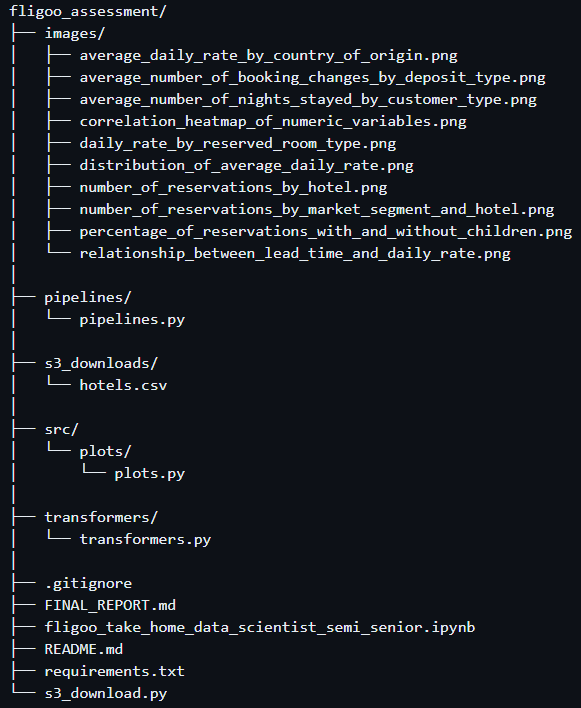

# Hotel Bookings Data Analysis and Prediction

## Project Overview

This project aims to analyze hotel bookings data to predict which hotel stays included children and/or babies based on various characteristics of the stays. The analysis and prediction are divided into three main parts:

1. **Exploratory Data Analysis (EDA)**
2. **Feature Extraction and Model Training**
3. **Presentation of Key Findings and Model Results**

## Project Structure

The project directory is organized as follows:




## Getting Started

### Prerequisites Installation

1. Clone the repository:
   ```bash
   git clone <https://github.com/yamil-abraham/fligoo_assessment.git>
   cd fligoo_assessment
2. Create a virtual environment and activate it:
    ```bash
    python -m venv env

    source env/bin/activate  
### On Windows use:

    env\Scripts\activate
3. Install the required packages:
    ```bash
    pip install -r requirements.txt
## Running the Project

1. Exploratory Data Analysis (EDA):

    - Open the Jupyter notebook fligoo_take_home_data_scientist_semi_senior.ipynb.

    - Run the cells to perform EDA and visualize the key findings.

2. Feature Extraction and Model Training:

    - The feature extraction and model training are implemented in the pipelines.py and transformers.py files.

    - Run the notebook cells to execute the pipeline and train the models.

3. Presentation of Key Findings:

    - The final report summarizing the key findings and model results is available in conclusions/final_report.md.

## Contact
For any questions or further information, please contact [Yamil Abraham] at [yamilabraham94@gmail.com].

## Note
This README provides an overview of the project. For detailed analysis and results, please refer to the Jupyter notebook and the final report in the conclusions directory.

---
